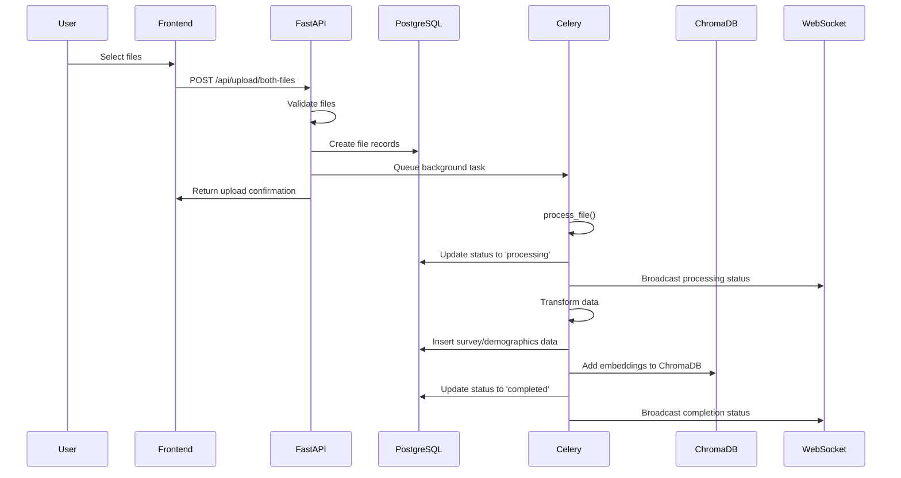
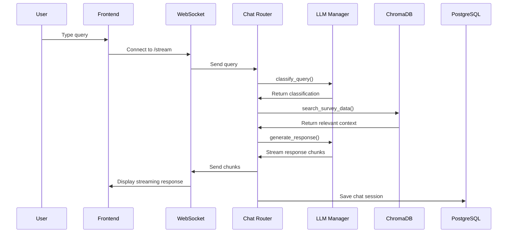
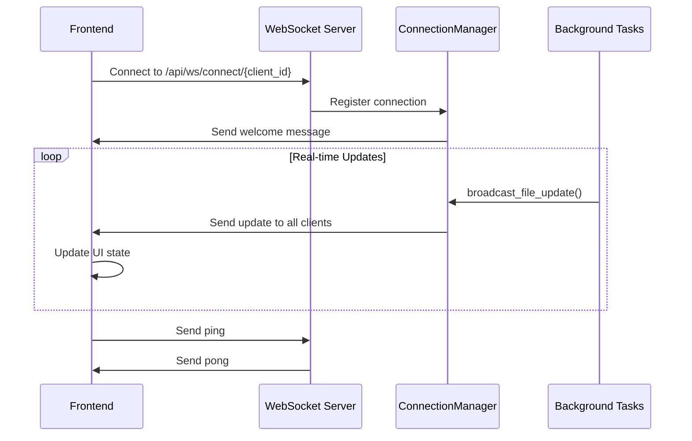
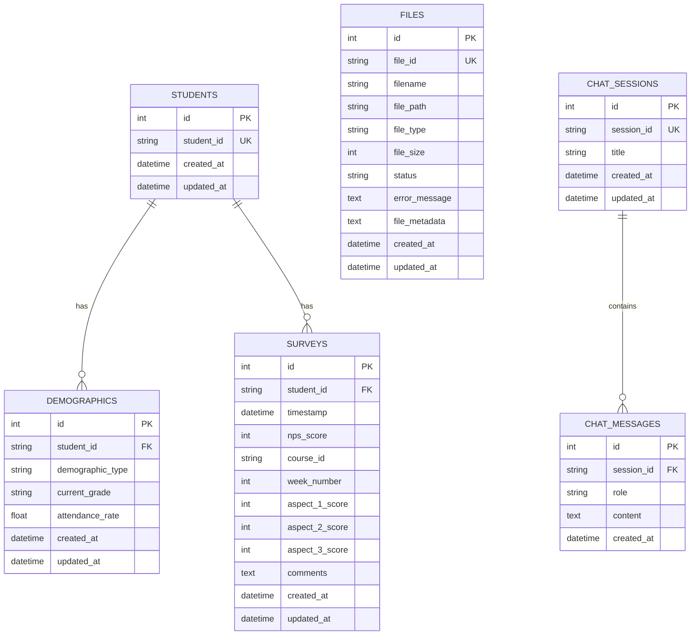
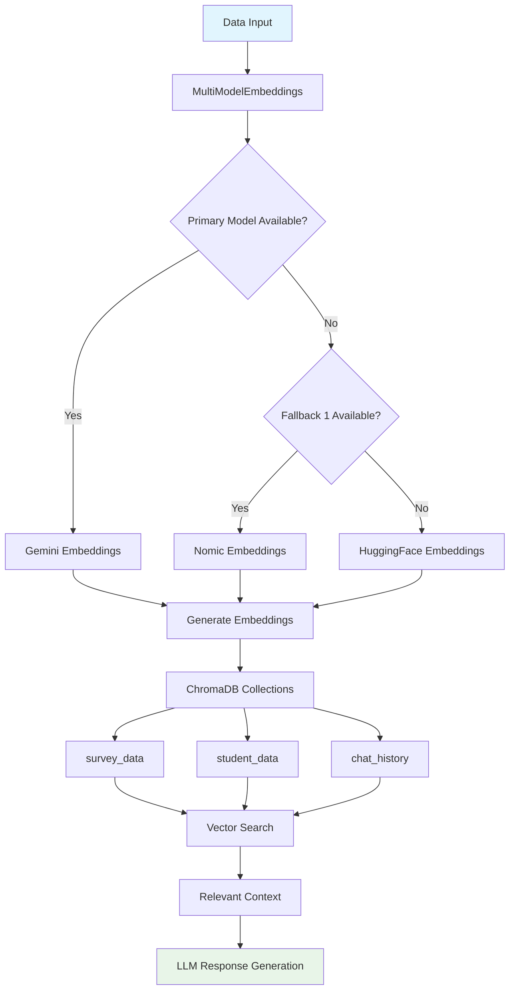
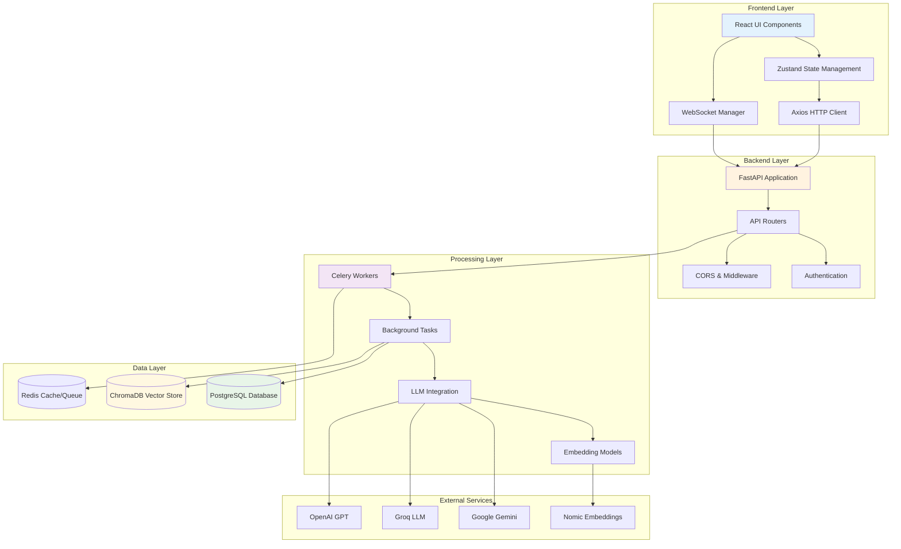

# RAG Student Sense - Application Flow Documentation

This document outlines the complete application flow, showing what happens in the background, which APIs and functions are called, and the data flow between components.

## Table of Contents
1. [Application Architecture](#application-architecture)
2. [File Upload Flow](#file-upload-flow)
3. [Chat Query Flow](#chat-query-flow)
4. [WebSocket Communication Flow](#websocket-communication-flow)
5. [Data Processing Pipeline](#data-processing-pipeline)
6. [Database Operations](#database-operations)
7. [Vector Store Operations](#vector-store-operations)

## Application Architecture

### Frontend (React + TypeScript)
- **Framework**: React with Vite
- **State Management**: Zustand
- **HTTP Client**: Axios
- **WebSocket**: Native WebSocket API
- **UI Components**: Custom components with Tailwind CSS

### Backend (Python + FastAPI)
- **Framework**: FastAPI
- **Database**: PostgreSQL (Neon.tech)
- **Vector Database**: ChromaDB
- **Background Tasks**: Celery with Redis
- **LLM Integration**: Multi-provider (Gemini, Groq, OpenAI)
- **Embeddings**: Multi-model fallback (Gemini, Nomic, HuggingFace)

---

## 1. File Upload Flow

### Frontend → Backend Flow

**Frontend Components:**
- `Upload.tsx` → User selects files
- `api.ts` → HTTP client functions
- `useUploadStore` → State management

**Backend Endpoints:**
- `POST /api/upload/both-files` → Main upload endpoint
- `GET /api/upload/status/{file_id}` → Status checking
- `GET /api/upload/files` → List files

### Step-by-Step Flow (Arrow Notation)

```
User selects files → Upload.tsx → uploadBothFiles() → POST /api/upload/both-files
                                                    ↓
FastAPI Router → upload.py → upload_both_files() → process_upload_file()
                                                    ↓
File validation → Save to disk → Create DB record → Background task
                                                    ↓
Celery Task → process_file() → process_survey_file() / process_demographics_file()
                                                    ↓
Data transformation → Database insertion → ChromaDB embedding → WebSocket notification
```

### Mermaid Diagram



### Functions Called

**Frontend:**
- `uploadBothFiles(npsFile, demographicsFile)` in `api.ts`
- `setUploadProgress()` in `useUploadStore`
- `handleFileUpload()` in `Upload.tsx`

**Backend:**
- `upload_both_files()` in `routers/upload.py`
- `process_upload_file()` in `routers/upload.py`
- `process_file()` in `celery_tasks/data_processing.py`
- `process_survey_file()` / `process_demographics_file()` in `celery_tasks/data_processing.py`
- `add_survey_data()` / `add_student_data()` in `vector_store.py`

---

## 2. Chat Query Flow

### Frontend → Backend Flow

**Frontend Components:**
- `Chat.tsx` → User interface
- `useChatStore` → Chat state management
- `api.ts` → API communication

**Backend Endpoints:**
- `POST /api/chat/query` → Main chat endpoint
- `WebSocket /api/chat/stream` → Streaming responses
- `POST /api/chat/classify` → Query classification

### Step-by-Step Flow (Arrow Notation)

```
User types query → Chat.tsx → handleSendMessage() → sendChatMessage()
                                                    ↓
POST /api/chat/query → chat.py → query_endpoint() → classify_query()
                                                    ↓
LLM classification → Vector search → Context retrieval → Response generation
                                                    ↓
Structured response → Database storage → Frontend update
```

### WebSocket Streaming Flow (Arrow Notation)

```
User query → WebSocket connection → /stream endpoint → classify_query()
                                                    ↓
Classification result → Vector search → LLM chain → Streaming response
                                                    ↓
Real-time chunks → Frontend display → Session storage
```

### Mermaid Diagram



### Functions Called

**Frontend:**
- `sendChatMessage()` in `api.ts`
- `handleSendMessage()` in `Chat.tsx`
- `addMessage()` in `useChatStore`
- `WebSocketManager.connect()` in `api.ts`

**Backend:**
- `query_endpoint()` in `routers/chat.py`
- `websocket_endpoint()` in `routers/chat.py`
- `classify_query()` in `routers/chat.py`
- `generate_response()` in `llm_integration.py`
- `search_survey_data()` in `vector_store.py`

---

## 3. WebSocket Communication Flow

### Connection Management

**Frontend:**
- `WebSocketManager` class in `api.ts`
- Connection lifecycle management
- Event handling and reconnection

**Backend:**
- `ConnectionManager` class in `routers/websocket.py`
- Client connection tracking
- Message broadcasting

### Step-by-Step Flow (Arrow Notation)

```
Frontend initialization → WebSocketManager.connect() → WebSocket /api/ws/connect/{client_id}
                                                    ↓
Connection accepted → ConnectionManager.connect() → Store active connection
                                                    ↓
Event handling → Message routing → Broadcast to clients
```

### Mermaid Diagram



### Functions Called

**Frontend:**
- `WebSocketManager.connect()` in `api.ts`
- `WebSocketManager.subscribe()` in `api.ts`
- `WebSocketManager.handleMessage()` in `api.ts`

**Backend:**
- `websocket_endpoint()` in `routers/websocket.py`
- `ConnectionManager.connect()` in `routers/websocket.py`
- `broadcast_file_update()` in `routers/websocket.py`

---

## 4. Data Processing Pipeline

### Background Processing with Celery

### Step-by-Step Flow (Arrow Notation)

```
File upload → Celery task queue → process_file() → File type detection
                                                    ↓
Survey file → process_survey_file() → Header mapping → Data transformation
                                                    ↓
Demographics file → process_demographics_file() → Data validation → Database insertion
                                                    ↓
Vector embeddings → ChromaDB storage → WebSocket notifications
```

### Mermaid Diagram

```mermaid
flowchart TD
    A[File Upload] --> B[Celery Task Queue]
    B --> C[process_file()]
    C --> D{File Type?}
    
    D -->|Survey| E[process_survey_file()]
    D -->|Demographics| F[process_demographics_file()]
    
    E --> G[Header Mapping with LLM]
    F --> H[Data Validation]
    
    G --> I[Data Transformation]
    H --> I
    
    I --> J[Database Insertion]
    J --> K[Vector Embeddings]
    K --> L[ChromaDB Storage]
    L --> M[WebSocket Notification]
    
    style A fill:#e1f5fe
    style M fill:#e8f5e8
```

### Functions Called

**Celery Tasks:**
- `process_file()` in `celery_tasks/data_processing.py`
- `process_survey_file()` in `celery_tasks/data_processing.py`
- `process_demographics_file()` in `celery_tasks/data_processing.py`
- `map_headers_with_llm()` in `celery_tasks/data_processing.py`
- `transform_survey_data()` in `celery_tasks/data_processing.py`
- `save_survey_data()` in `celery_tasks/data_processing.py`
- `add_survey_data_to_chroma()` in `celery_tasks/data_processing.py`

---

## 5. Database Operations

### Database Models and Relationships

### Step-by-Step Flow (Arrow Notation)

```
Data insertion → SQLAlchemy models → Database validation → Relationship mapping
                                                    ↓
Student model → Demographics relationship → Survey relationship → File tracking
```

### Mermaid Diagram



### Functions Called

**Database Operations:**
- `init_db()` in `database.py`
- `get_db()` in `database.py`
- `get_sync_db()` in `celery_tasks/data_processing.py`
- Model operations through SQLAlchemy ORM

---

## 6. Vector Store Operations

### ChromaDB Integration

### Step-by-Step Flow (Arrow Notation)

```
Data processing → Embedding generation → ChromaDB collections → Vector search
                                                    ↓
MultiModelEmbeddings → Fallback strategy → Collection management → Query processing
```

### Mermaid Diagram



### Functions Called

**Vector Store Operations:**
- `ChromaManager.__init__()` in `vector_store.py`
- `MultiModelEmbeddings.embed_documents()` in `vector_store.py`
- `MultiModelEmbeddings.embed_query()` in `vector_store.py`
- `add_survey_data()` in `vector_store.py`
- `add_student_data()` in `vector_store.py`
- `search_survey_data()` in `vector_store.py`
- `search_student_data()` in `vector_store.py`

---

## Complete Application Flow Summary

### High-Level Architecture Flow (Arrow Notation)

```
User Interaction → Frontend (React) → API Gateway (FastAPI) → Business Logic
                                                    ↓
Background Processing (Celery) → Database (PostgreSQL) → Vector Store (ChromaDB)
                                                    ↓
LLM Processing (Multi-provider) → Response Generation → Real-time Updates (WebSocket)
```

### Complete System Mermaid Diagram



## Key Integration Points

1. **Frontend ↔ Backend**: REST API + WebSocket communication
2. **Backend ↔ Database**: SQLAlchemy ORM with async support
3. **Backend ↔ Vector Store**: ChromaDB with multi-model embeddings
4. **Backend ↔ LLM Services**: Multi-provider fallback strategy
5. **Background Processing**: Celery with Redis for task queuing
6. **Real-time Updates**: WebSocket broadcasting for live updates

This flow documentation provides a comprehensive overview of how data moves through the RAG Student Sense application, from user interaction to final response generation and storage.